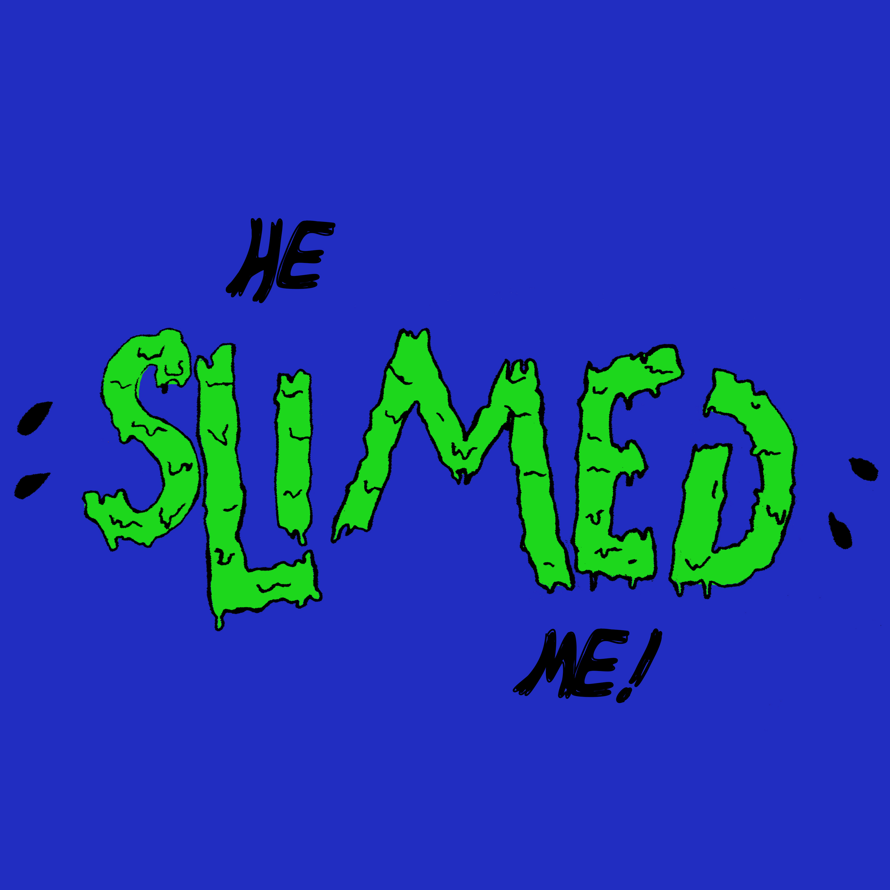

# A Dao of Web Design
## By [John Allsopp](https://alistapart.com/author/johnallsopp) April 7, 2000

## Summary by [Steven Rudin](#about-the-author) September 9, 2017

- [Summary](#summary)
- [About the Author](#about-the-author)
- [Best Practices](#best-practices)

- - -

# Summary

Many new mediums are discovered, but we base the execution of those new mediums off of old methods. When new things are discovered, we often look back to our previous techniques and try to use them on this new medium. However, we notice how counter-intuitive that is. We struggle with the medium and grow frustrated. But the problem isn’t really the medium. It is the method. The problem is that we must adjust the technique, or totally scrap the technique all together because this new medium is its own thing. That is what this article is communicating. But, the beautiful thing is that you find this out through the frustration and use of old media. As the saying goes, “to know where you are going, you first have to know where you are coming from”. That is completely true in this scenario.

---

.jpg)

# About the Author

Steven Rudin is a graphic design student at Montserrat College of Art in Beverly, Massachusettes. He is currently in his sophomore year. His style of design leans towards either old victorian style or retro 1950's-1970's. He designs apperal, logos, and posters using these styles. Aside from his life as a designer, he is also a working magician. He spends his weekends at King Richard's Faire in Carver, Massachusetts. He also performs street magic in Beverly, Salem, Boston, and Wareham, Massachusetts. He spends his leisure time at the beach, reading, watching old sci-fi movies, playing games on his xbox, and creating art.    
 
 

# Best Practices
### Naming (Conventions) Things

- Use lowercase for naming files, folders, and in markup
- Use a hyphen (-) or an underscore(_) and not a space (%20) when separating phrases in naming files, folders, and in markup.

### Project (Folder, Repo) Structure
#### For Example
- Ebb-flow
  - README.md
  - index.md
  - index.html
  - img/
